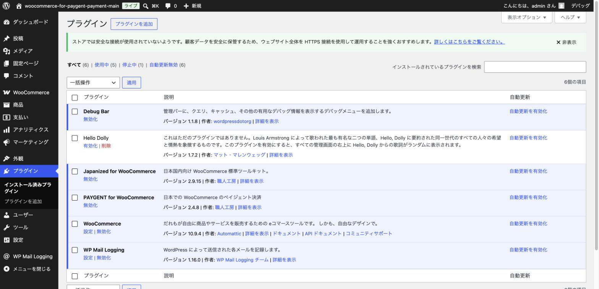

# プラグインのインストールと有効化

## やること

PAYGENT for WooCommerce プラグインを WordPress にインストールし、有効化します。

PAYGENT for WooCommerce は WordPress.org の公式プラグインディレクトリで配布されているため、
管理画面から検索してそのままインストールできます。ZIP ファイルを別途ダウンロードして
アップロードする必要はありません。

## 手順（方法1: 管理画面から直接インストールする・おすすめ）

1. WordPress 管理画面にログインします。
2. 左メニューの「プラグイン」→「新規追加」を開きます。
3. 画面右上の検索欄に「PAYGENT for WooCommerce」と入力します。
4. 検索結果に表示された「PAYGENT for WooCommerce」の「今すぐインストール」をクリックします。
5. インストールが完了したら「有効化」をクリックします。

## 手順（方法2: ZIP ファイルをダウンロードしてアップロードする）

サーバーの制限などで管理画面からの検索・インストールができない場合は、ZIP ファイルを手元にダウンロードしてから
アップロードすることもできます。

1. WordPress.org の配布ページ（`https://ja.wordpress.org/plugins/woocommerce-for-paygent-payment-main/`）から、プラグインの ZIP ファイルをダウンロードします。
2. WordPress 管理画面にログインします。
3. 左メニューの「プラグイン」→「新規追加」を開きます。
4. 画面上部の「プラグインのアップロード」をクリックします。
5. 手順1でダウンロードした ZIP ファイルを選択し、「今すぐインストール」をクリックします。
6. インストールが完了したら「プラグインを有効化」をクリックします。

## 有効化されたことを確認する

「プラグイン」の一覧画面を開き、「PAYGENT for WooCommerce」が「有効化」の状態になっていることを確認しましょう。

## ポイント・注意

- プラグインを有効化すると、WordPress 管理画面の左メニュー「WooCommerce」の下に、新しく **「ペイジェント設定」** という項目が追加されます。次の章ではこの画面を使って設定を行います。
- 有効化した直後は、まだ加盟店情報（マーチャントIDなど）を入力していないため、決済は動作しません。エラーメッセージや警告バナーが表示されることがありますが、この時点では問題ありません。次章で解消していきます。
- WooCommerce 本体がインストール・有効化されていないと、このプラグインは正しく動作しません。先に WooCommerce が有効になっているか確認してください。

次は [基本設定（加盟店情報の入力）](03-basic-settings.md) に進みましょう。
