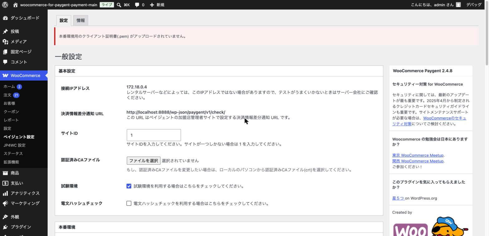
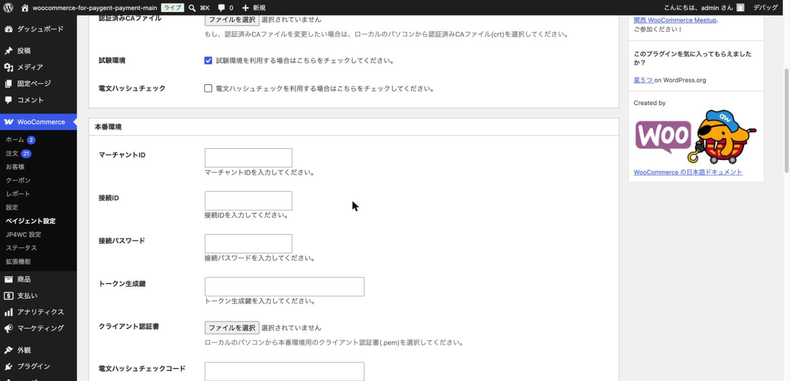
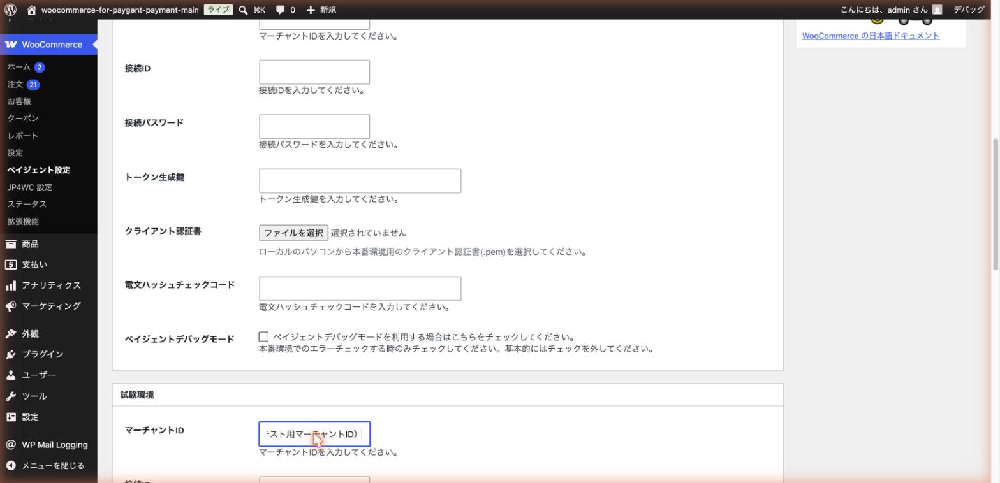
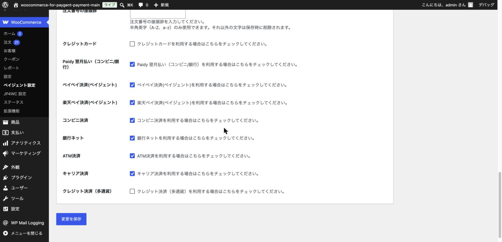
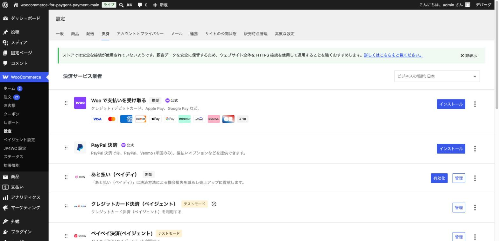

# 基本設定（加盟店情報の入力）

## やること

ペイジェント社から発行された契約情報（マーチャントIDなど）を管理画面に入力し、
プラグイン全体の基本設定を行います。この章の設定はすべての決済手段に共通する、**最も重要な設定**です。

## 手順

### 1. ペイジェント設定画面を開く

WordPress 管理画面の左メニューから「WooCommerce」→「ペイジェント設定」を開きます。

### 2. 基本設定を確認する

画面上部の「基本設定」セクションには、以下の項目があります。

- **接続IPアドレス**: サーバーの接続元IPアドレスが自動表示されます。レンタルサーバーによってはこの値と異なる場合があるため、決済がうまくいかない時はサーバー会社に確認しましょう。
- **決済情報差分通知URL**: コンビニ決済や銀行ネットなど、入金確認に時間がかかる決済手段の入金通知を受け取るためのURLです。このURLは、後述するペイジェント社の加盟店管理サイト側の設定にも登録する必要があります（設定方法はペイジェント社にお問い合わせください）。
- **サイトID**: 通常は「1」のままで問題ありません（サイトが複数ある契約の場合のみ変更します）。
- **認証済みCAファイル**: 通常は空欄のままで問題ありません。ペイジェント社から特別な指示があった場合のみアップロードします。
- **試験環境**: チェックが入っていると、テスト環境用の認証情報で動作します。最初はチェックを入れたまま作業を進めます（詳しくは [テスト環境での動作確認の進め方](09-testing-overview.md) で解説します）。
- **電文ハッシュチェック**: 通信の改ざんを検知するオプション機能です。利用する場合はペイジェント社から発行される「電文ハッシュチェックコード」も合わせて入力します（下記「本番環境」「試験環境」セクション内）。

### 3. 本番環境の情報を入力する

下にスクロールすると「本番環境」セクションがあります。ペイジェント社から発行された**本番用**の情報を入力します。

- **マーチャントID** / **接続ID** / **接続パスワード**: 契約時に発行される認証情報です。
- **トークン生成鍵**: クレジットカードのトークン決済（カード情報を直接保存しない仕組み）を利用する場合に必要です。
- **クライアント認証書**: `.pem` 形式の証明書ファイルをアップロードします。この証明書がないと本番環境での決済ができません。
- **電文ハッシュチェックコード**: 「電文ハッシュチェック」を有効にする場合のみ入力します。
- **ペイジェントデバッグモード**: 本番環境でエラーが発生した際の調査用です。普段はチェックを外しておきます。

> **注意**: 本番用の情報はテストが完了し、実際に販売を開始する直前に入力すれば十分です。慌てて先に入力する必要はありません。

### 4. 試験環境の情報を入力する

続けて「試験環境」セクションに、ペイジェント社から発行された**テスト用**の情報を入力します。入力項目は本番環境と同じです。

まずはこの試験環境の情報だけを入力し、テスト環境（サンドボックス）で決済の流れを一通り確認することを強くおすすめします。

### 5. 利用する決済手段にチェックを入れる

さらに下にスクロールすると、利用する決済手段を選択するチェックボックスが並んでいます。

- **注文番号の接頭辞**: 注文番号の先頭に付ける文字列です（任意）。半角英字（A-Z、a-z）のみ使用できます。**一度運用を始めた後に変更すると、過去の注文の管理に影響する場合があるため、変更する場合は注意してください。**
- 導入したい決済手段（クレジットカード、コンビニ決済、PayPay など）にチェックを入れます。契約していない・まだ使わない決済手段はチェックを外したままにしておきます。

### 6. 設定を保存する

画面下部の「変更を保存」ボタンをクリックします。

## ポイント・注意

- この画面で入力した情報は、次章以降で解説する各決済手段（クレジットカード、コンビニ決済など）の設定タブから直接編集することはできません。認証情報の変更は、必ずこの「ペイジェント設定」画面から行います。
- 保存後、WooCommerce の「設定」→「決済」タブを開くと、チェックを入れた決済手段が一覧に表示されるようになります。

「テストモード」というバッジが表示されている決済手段は、先ほどの「試験環境」にチェックが入っている間、テスト用の認証情報で動作していることを示します。

次は主要な決済手段の設定に進みましょう。まずは [クレジットカード決済の設定](04-credit-card.md) です。
