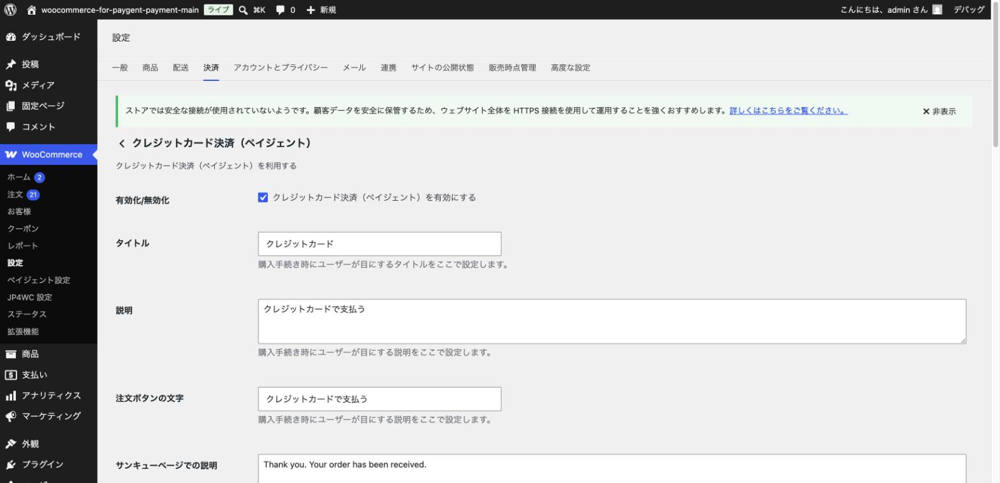
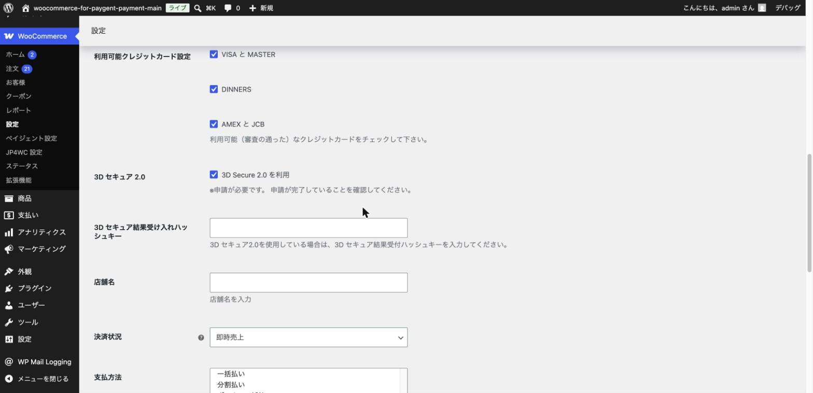

# クレジットカード決済の設定

## やること

ネットショップで最も利用されることが多い、クレジットカード決済の詳細設定を行います。

前提として、[基本設定（加盟店情報の入力）](03-basic-settings.md) で「クレジットカード」にチェックを入れて保存済みであることを確認してください。

## 手順

### 1. 決済設定タブを開く

WordPress 管理画面の「WooCommerce」→「設定」→「決済」タブを開き、一覧から「クレジットカード決済（ペイジェント）」の「管理」ボタンをクリックします。

### 2. 基本項目を設定する

- **有効化/無効化**: チェックを入れるとこの決済方法がお客様に表示されます。
- **タイトル**: チェックアウト画面でお客様に表示される名前です（例: 「クレジットカード」）。
- **説明**: タイトルの下に表示される補足文です。
- **注文ボタンの文字**: 注文確定ボタンに表示される文字です。
- **サンキューページでの説明**: 決済完了後にお客様が見るページの説明文です。

分かりやすい日本語に書き換えておくと、お客様に親切です（例: 「クレジットカードで支払う」）。

### 3. 利用可能なカードブランドと3Dセキュアを設定する

さらに下にスクロールすると、以下の項目があります。

- **利用可能クレジットカード設定**: 「VISA と MASTER」「DINNERS」「AMEX と JCB」から、ペイジェント社との契約で利用できる（審査の通った）ブランドにチェックを入れます。
- **3D セキュア 2.0**: 不正利用を防ぐための本人認証の仕組みです。**利用にはペイジェント社への事前申請が必要**です。申請が完了していない状態でチェックを入れると決済が失敗するため、申請状況を確認してから有効にしてください。
- **3D セキュア結果受け入れハッシュキー**: 3Dセキュア2.0を利用する場合に、ペイジェント社から発行される値を入力します。
- **店舗名**: 3Dセキュアの認証画面等に表示される店舗名です。
- **決済状況**: 「即時売上」（注文と同時に代金を確定する）か、「与信決済」（与信枠を確保するだけで、後日あらためて売上確定処理を行う）かを選びます。初めての場合は「即時売上」で問題ありません。
- **支払方法**: 「一括払い」「分割払い」「ボーナス一括払い」「リボルビング払い」から、お客様に案内したい支払方法を選択します。「分割払い」を選ぶと、分割回数の選択肢も表示されます。

### 4. 設定を保存する

画面下部の「変更を保存」ボタンをクリックします。

## ポイント・注意

- 3Dセキュアはセキュリティ向上のため、可能な限り有効化することをおすすめします。ただし前述の通り事前申請が必要なため、申請中の場合はチェックを外したまま運用し、申請完了後に改めて有効化してください。
- クレジットカード情報（カード番号など）は、決済代行会社であるペイジェント社側で処理される仕組み（トークン方式）になっており、自社のサーバーには保存されません。安心して利用できる仕組みです。
- お客様のカード情報を保存して次回以降の購入を簡単にする「カード情報保存」機能もあります。定期購入（サブスクリプション）を扱う場合に便利な機能です。

次は [コンビニ決済の設定](05-convenience-store.md) に進みましょう。
