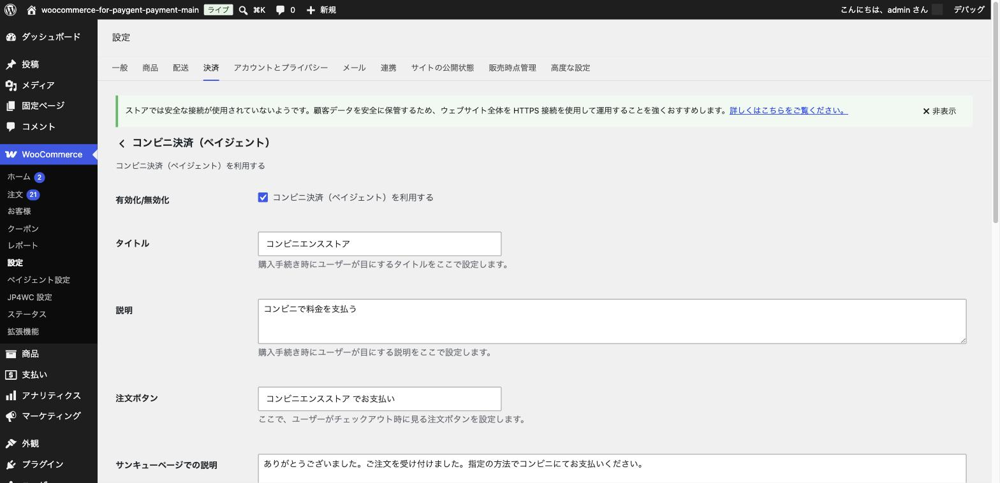
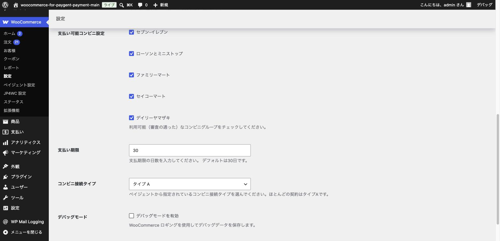

# コンビニ決済の設定

## やること

クレジットカードを持たないお客様や、現金での支払いを好むお客様に人気の「コンビニ決済」を設定します。

前提として、[基本設定（加盟店情報の入力）](03-basic-settings.md) で「コンビニ決済」にチェックを入れて保存済みであることを確認してください。

## コンビニ決済の仕組み

コンビニ決済は、次のような流れで進みます。

1. お客様がチェックアウト画面で「コンビニ決済」を選び、注文を確定する
2. 支払い番号（お客様がコンビニのレジや端末で入力する番号）が発行される
3. お客様が期限内にコンビニ店頭で支払う
4. 入金が確認されると、自動的に注文のステータスが更新される

クレジットカード決済と違い、**注文が確定してもすぐに入金されるわけではない**という点が大きな特徴です。

## 手順

### 1. 決済設定タブを開く

「WooCommerce」→「設定」→「決済」タブから、「コンビニ決済（ペイジェント）」の「管理」ボタンをクリックします。

### 2. 基本項目を設定する

タイトル・説明・注文ボタンの文字・サンキューページでの説明を、お客様に分かりやすい文言に設定します。

### 3. 対応コンビニと支払い期限を設定する

- **支払い可能コンビニ設定**: セブン-イレブン、ローソンとミニストップ、ファミリーマート、セイコーマート、デイリーヤマザキから、契約で利用できる（審査の通った）コンビニをチェックします。
- **支払い期限**: 注文からお客様が支払うまでの猶予日数です。デフォルトは30日ですが、実店舗での運用に合わせて調整できます。
- **コンビニ接続タイプ**: ペイジェント社から指定されたタイプを選びます。**ほとんどの契約では「タイプA」**です。契約内容が分からない場合はペイジェント社にご確認ください。

### 4. 設定を保存する

画面下部の「変更を保存」ボタンをクリックします。

## ポイント・注意

- 支払い期限を過ぎると、その注文でのコンビニ支払いはできなくなります。お客様には注文完了メールなどで期限をしっかり案内しましょう。
- 入金確認は自動で行われますが、コンビニでの支払いから実際にサイト上の注文ステータスが更新されるまで、多少の時間差が生じることがあります。すぐに反映されない場合も、まず少し時間を置いてから確認してください。

次は [PayPay決済の設定](06-paypay.md) に進みましょう。
