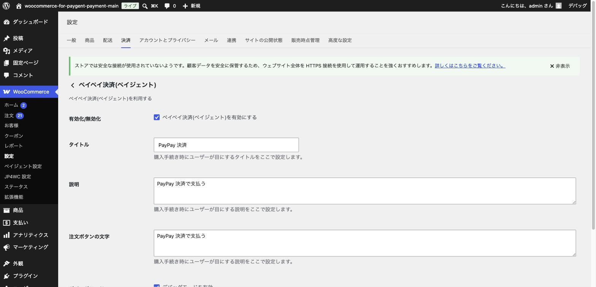

# PayPay決済の設定

## やること

日本国内で広く普及しているスマホ決済「PayPay」を設定します。設定項目が少なく、最も手軽に導入できる決済手段の一つです。

前提として、[基本設定（加盟店情報の入力）](03-basic-settings.md) で「ペイペイ決済(ペイジェント)」にチェックを入れて保存済みであることを確認してください。

## PayPay決済の仕組み

1. お客様がチェックアウト画面で「PayPay」を選び、注文を確定する
2. PayPay の決済画面（アプリまたはWeb）にリダイレクトされる
3. お客様が PayPay アプリで支払いを認証する
4. 自動的にネットショップのサイトに戻り、注文が完了する

## 手順

### 1. 決済設定タブを開く

「WooCommerce」→「設定」→「決済」タブから、「ペイペイ決済(ペイジェント)」の「管理」ボタンをクリックします。

### 2. 項目を設定する

- **有効化/無効化**: チェックを入れるとお客様に表示されます。
- **タイトル**: チェックアウト画面での表示名です（例: 「PayPay」）。
- **説明**: 補足の説明文です。
- **注文ボタンの文字**: 注文確定ボタンの文言です。
- **デバッグモード**: 通常はチェックを外したままにしておきます。動作確認中にエラーの詳細を確認したい場合のみ有効にします。

### 3. 設定を保存する

画面下部の「変更を保存」ボタンをクリックします。

## ポイント・注意

- PayPay はスマートフォンでの利用が中心です。パソコンからの注文でも、お客様のスマホの PayPay アプリと連携して支払いが完了します。
- 設定完了後は、必ずテスト環境で実際に一連の流れ（注文 → PayPay 認証画面への遷移 → サイトへの復帰 → 注文完了）を確認しましょう。確認方法は [テスト環境での動作確認の進め方](09-testing-overview.md) で解説しています。

次は [その他の決済手段](07-other-payment-methods.md) を確認しましょう。
