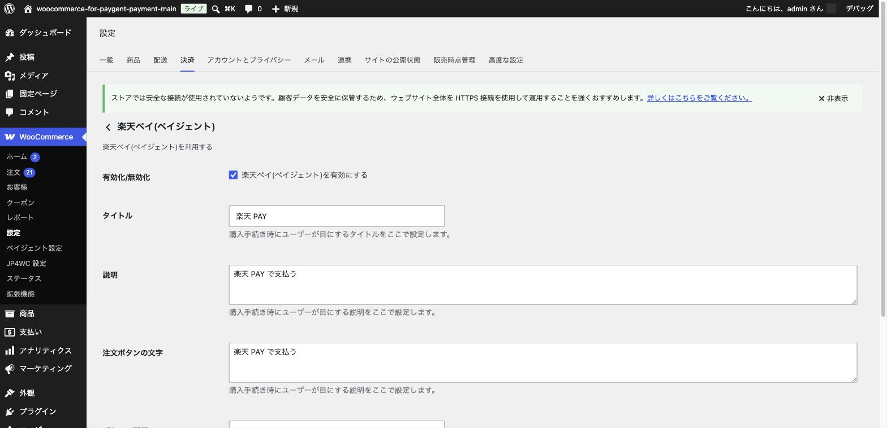

# その他の決済手段

## やること

クレジットカード・コンビニ決済・PayPay 以外にも、PAYGENT for WooCommerce では日本国内向けの様々な決済手段に対応しています。
この章では、それぞれの特徴と設定の考え方を簡単に紹介します。

## 共通の設定手順

これらの決済手段はいずれも、これまでの章と同じ流れで設定できます。

1. [基本設定（加盟店情報の入力）](03-basic-settings.md) で、該当する決済手段にチェックを入れて保存する
2. 「WooCommerce」→「設定」→「決済」タブから、該当する決済手段の「管理」ボタンをクリックする
3. 有効化・タイトル・説明・注文ボタンの文字などを設定して保存する

例として、楽天ペイの設定画面を見てみましょう。

このように、有効化のチェックボックスと、お客様向けの表示文言を設定するだけのシンプルな構成が多くなっています。

## 各決済手段の紹介

### Paidy（あと払い）

コンビニ・銀行振込で後払いができるサービスです。クレジットカードを持たないお客様にも利用しやすい決済手段です。

> **設定の注意**: Paidyは、共通の設定手順に加えて、Paidy自体の管理画面で取得できる「API公開鍵」を、決済設定タブ内の「API公開鍵」欄（本番用・試験用それぞれ）に入力する必要があります。この鍵が未入力のままだと、チェックアウト画面にPaidyが表示されていても決済処理が開始されない状態になってしまいます。設定前にPaidyの管理画面でAPI公開鍵を取得しておいてください。

### 楽天ペイ

楽天会員向けのスマホ決済・オンライン決済です。楽天ユーザーが多い商材と相性が良い決済手段です。

### 銀行ネット

インターネットバンキングを利用したオンライン振込決済です。

### ATM決済（仮想口座）

注文ごとに「収納機関番号」「お客様番号」「確認番号」が発行され、お客様がこれらの番号を
ペイジー（Pay-easy）対応のATMやインターネットバンキングの画面に入力して支払う決済手段です。
通常の銀行振込（相手の口座番号を指定して振り込む方式）とは異なる仕組みですので、
お客様への案内文言も「振込先口座」ではなく、ペイジーの番号を入力する手順として説明することをおすすめします。

### キャリア決済

auかんたん決済・d払い・ソフトバンクまとめて支払い（B）・ワイモバイルまとめて支払いなど、携帯電話の利用料金と合算して支払える決済手段です。
携帯キャリアごとに個別の契約・審査が必要になる場合があります。

> **契約していないキャリアは必ず無効化してください**: キャリア決済の設定タブでは、au・docomo・SoftBankの利用可否チェックボックスが**すべて初期値で有効（チェック済み）になっています**。契約したキャリアだけを有効にしているつもりでも、実際には未契約のキャリアもお客様に表示されてしまいます。未契約のキャリアをお客様が選択すると決済がペイジェント側で拒否されるため、キャリア決済を有効化する際は、必ず設定タブを開いて**契約しているキャリアだけにチェックが入っているか**を確認し、契約していないキャリアのチェックは外してください。

> **定期購入（継続課金）を利用する場合の注意**: キャリア決済で継続課金（WooCommerce Subscriptions連携）を正しく動作させるには、[基本設定](03-basic-settings.md) で**クレジットカード決済もあわせて有効化しておく必要があります**。クレジットカード決済を無効のままにしていると、キャリア決済は継続課金に対応した内部処理（次回請求の自動実行）が組み込まれない状態で動作してしまい、初回のみ課金されて2回目以降の請求が行われない、という不具合につながります。キャリア決済で継続課金を提供する予定がある場合は、クレジットカード決済も必ず有効にしてください。

### クレジット決済（多通貨）

日本円以外の通貨でクレジットカード決済を受け付けたい場合に利用する決済手段です。海外のお客様向け販売を検討している場合に有効です。

> **対応通貨についての注意**: この決済手段は、ストアの通貨設定（WooCommerceの「設定」→「一般」の「通貨」）が以下のいずれかになっている場合のみチェックアウト画面に表示されます。上記以外の通貨（日本円を含む）を設定している場合は、この決済手段を有効にしていても自動的に非表示になりますのでご注意ください。
>
> USD, EUR, GBP, KRW, CNY, TWD, HKD, SGD, AUD, CAD, DKK, INR, MYR, NOK, PHP, RUB, VND, SEK, CHF, THB, BRL, IDR, AED

## ポイント・注意

- 決済手段によっては、ペイジェント社との契約の中で個別の追加審査が必要な場合があります。導入したい決済手段が決まったら、事前にペイジェント社へご確認ください。
- はじめて決済を導入する場合は、まず [クレジットカード決済](04-credit-card.md)・[コンビニ決済](05-convenience-store.md)・[PayPay](06-paypay.md) から始め、お客様の反応を見ながら他の決済手段を追加していくのがおすすめです。

次は、実際にお客様から注文が入った後の [注文の管理（決済確認・返金・キャンセル）](08-order-management.md) を見ていきましょう。
