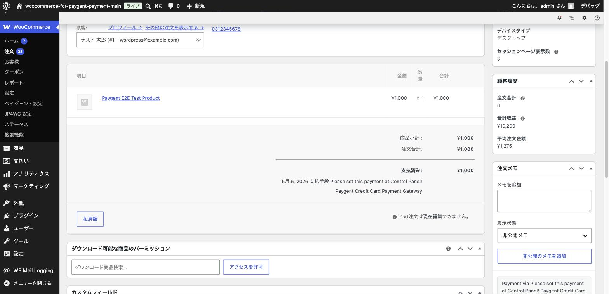
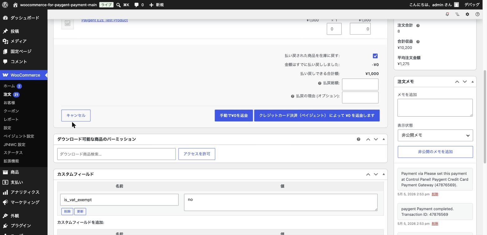
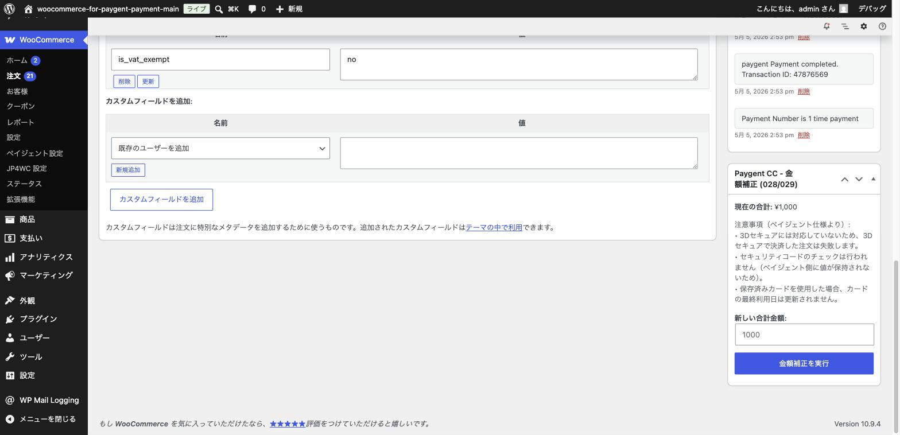

# 注文の管理（決済確認・返金・キャンセル）

## やること

決済設定が完了すると、お客様からの注文が入ってくるようになります。この章では、注文詳細画面での決済状況の確認方法や、
返金・金額変更といった日常的な運用操作を解説します。

## 手順

### 1. 注文詳細画面を開く

「WooCommerce」→「注文」から、確認したい注文をクリックして詳細画面を開きます。

### 2. 決済結果を確認する

注文詳細画面には、ペイジェント側とのやり取りの結果が「注文メモ」として自動的に記録されます。

- 画面上部に「支払済み」の金額と決済手段が表示されます。
- 右側の「注文メモ」欄には、決済結果に関する補足情報が記録されます。**ただし、コンビニ決済・ATM決済の場合は取引IDが注文メモに記録されません。**
- 取引ID（Transaction ID）は、注文編集画面の「全般」パネル内、「支払い方法」欄の下にある「Transaction ID」欄で確認できます（すべての決済手段共通）。トラブル発生時にペイジェント社へ問い合わせる際は、この取引IDが手がかりになります。

### 3. 返金する

商品の返品などで返金が必要になった場合、「払戻額」ボタンから操作します。

1. 「払戻額」ボタンをクリックすると、返金操作パネルが開きます。
2. 「払戻総額」に返金したい金額を入力します（一部返金・全額返金どちらも可能です）。
3. 必要であれば「払戻の理由」を入力します。
4. 決済手段名が入ったボタン（例:「クレジットカード決済（ペイジェント）によって返金します」）をクリックすると、ペイジェント側に自動的に返金指示が送られます。

> **注意**: 「手動で返金」ボタンは、ペイジェント側には返金指示を送らず、WooCommerce上の記録だけを変更する操作です。実際にお客様へお金を返す場合は、必ず決済手段名が入ったボタンを使用してください。

> **注意（決済手段による制限）**: 決済手段によっては、一部返金に対応していないものがあります。例えば**楽天ペイは全額返金のみ対応**しており、注文金額より少ない金額を入力して返金しようとすると失敗します。一部返金をしたい場合は、あらかじめその決済手段が対応しているか確認してください。
>
> **特に注意（Paidy）**: **Paidyは「一部返金」の金額指定が反映されません。** 払戻総額に注文金額より少ない金額を入力して返金操作を行っても、ペイジェント側では入力した金額に関わらず**取引全体が取り消し・全額返金されます**。一方でWooCommerce側の記録には、入力した一部金額だけが返金されたように表示されてしまうため、実際の返金額との食い違いに気づきにくい点が特に危険です。Paidyの注文で一部返金をしたい場合は、この操作を使わず、必ずペイジェント社にご相談ください。

### 4. クレジットカード決済の金額補正（注文金額の変更）

クレジットカード決済の注文は、決済状況（与信決済・即時売上のどちらでも）にかかわらず、あとから金額を変更できます。
注文詳細画面の右側に、専用のパネルが表示されます。

「新しい合計金額」を入力し、「金額補正を実行」ボタンをクリックすると、注文金額が変更されます。
「与信決済」で売上確定前の注文（オーソリ状態）だけでなく、「即時売上」で決済済み・確定済みの注文でも利用できます。

> **注意**: 3Dセキュアを利用して決済した注文では、この金額補正機能は利用できません（パネルは表示されますが、入力欄とボタンが無効の状態になります）。これは、金額補正後の決済が3Dセキュア未使用の決済として扱われ、不正利用によるチャージバック（支払い取消）が発生した際にペイジェント側の補償対象外となってしまうためです。

### 5. コンビニ・銀行ネット・ATM決済の入金確認

**コンビニ決済・銀行ネット**は、お客様の入金が確認され次第、自動的に注文ステータスが更新されます。手動での操作は基本的に不要です。

> **注意（ATM決済）**: 執筆時点のバージョンでは、**ATM決済（仮想口座）は入金通知を受け取っても注文ステータスが自動更新されません**。ATM決済を利用している場合は、ペイジェント社の加盟店管理者サイトで入金状況を定期的に確認し、入金が確認できた注文は手動でステータスを更新してください。この制限は将来のアップデートで解消される可能性があります。

入金前にキャンセルしたい場合は、通常の WooCommerce の注文ステータス変更操作から「キャンセル」に変更します。ただし、後述の「運用上の注意事項」もあわせてご確認ください。

## 運用上の注意事項

- **管理画面から手動で作った注文は、管理画面での操作だけでは決済されません**: WooCommerceの「注文を追加」機能で注文を作成しても、保存やステータス変更をした時点でペイジェント側に決済が行われるわけではありません。ただし、作成した注文の「お支払いリンク」（お客様が使う決済ページのURL）をお客様に送り、お客様がそのページで実際に決済すれば、通常のチェックアウトと同じようにペイジェント側の決済が行われます。電話注文などでこの方法を使う場合は、この仕組みを正しく理解した上で運用してください。
- **キャンセル・取消は必ず「払戻額」から行います**: オーソリ状態（与信決済で確定前）の注文であっても、確定済みの注文であっても、キャンセルしたい場合は本章で紹介した「払戻額」操作から行ってください。
- **コンビニ決済は入金後の返金ができません**: コンビニ決済は、お客様が入金を完了した後は、ペイジェント経由でお客様へ返金することができません。入金確認後の返金対応が必要な場合は、別途振込などの方法をご案内ください（入金前のキャンセルは可能です）。
- **コンビニ・銀行ネット・ATM決済の注文を「キャンセル」にしても、ペイジェント側の支払い手続きは無効になりません**: WooCommerce側で注文を「キャンセル」ステータスに変更しても、ペイジェント側へキャンセル指示は送られないため、お客様は支払期限内であればキャンセル後もそのまま発行済みの番号などで支払いができてしまいます。もしキャンセル後にお客様が支払いを完了すると、コンビニ決済・銀行ネットでは注文が無警告のまま「処理中」に巻き戻ります。さらにATM決済では注文ステータスが変わらないため、入金があったこと自体に気づけません。在庫確保などの理由でキャンセルした注文がある場合は、支払期限が過ぎるまで注文状況とペイジェント社の加盟店管理者サイトでの入金状況を定期的に確認してください。支払いを確実に止めたい場合は、ペイジェント側での申込キャンセルが可能かどうかをペイジェント社にご相談ください。
- **決済状況は定期的に確認しましょう**: 基本的にペイジェント側とWooCommerce側の決済状況は自動的に同期されますが、まれにインターネット回線の状況などにより同期されないことがあります。週または月に一度は、入金未確認の注文がないか確認することをおすすめします。

## ポイント・注意

- 決済に関するトラブルが発生した場合は、まず「Transaction ID」欄の取引IDと、注文メモに記録されているエラー内容を確認しましょう。ペイジェント社に問い合わせる際にもこの情報が役立ちます。
- 返金操作は取り消せません。金額や対象の注文を間違えないよう、実行前に必ず確認しましょう。

次は、本番運用の前に必ず行いたい [テスト環境での動作確認の進め方](09-testing-overview.md) について解説します。
